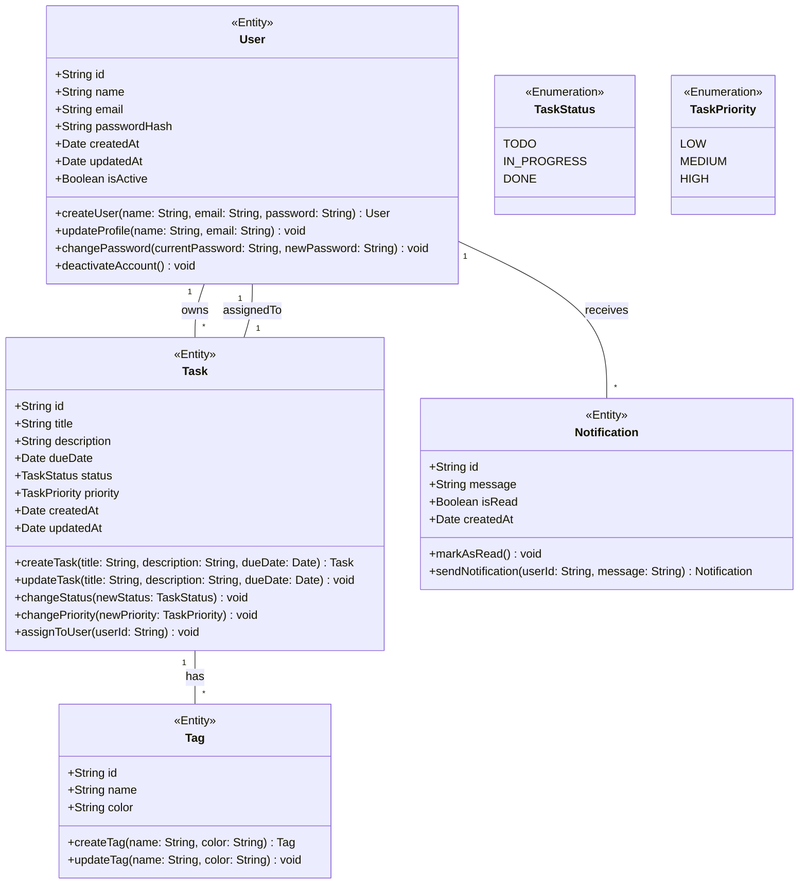
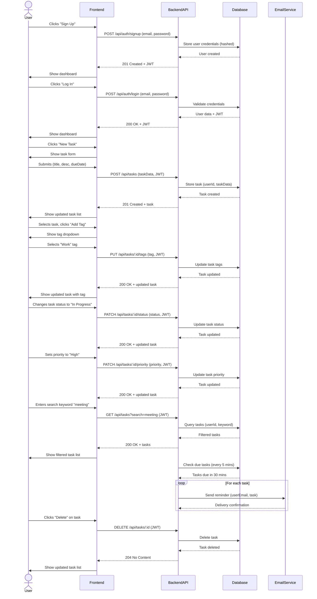
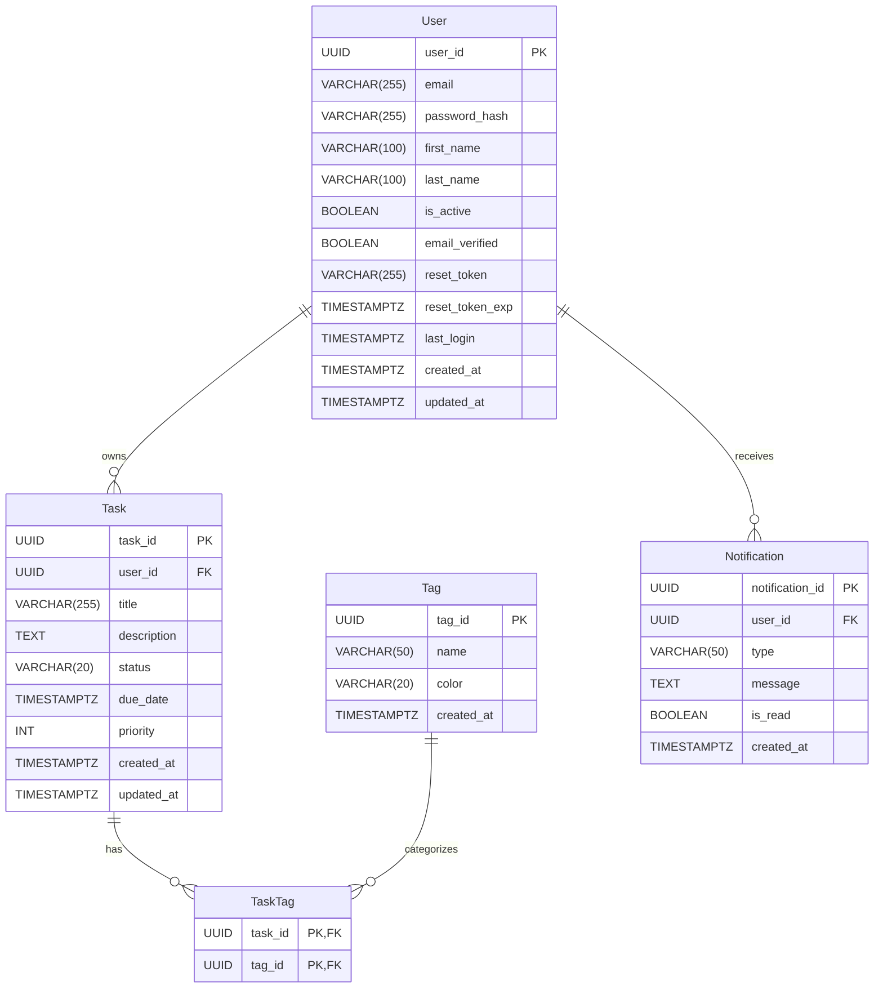

# Design Document

**Project:** TaskFlow
**Generated At:** 2026-04-06 13:06:31

---

## 1. Architecture Design

# **TaskFlow - Software Architecture Document**

## **1. System Overview**
TaskFlow is designed as a **modular monolithic** application with clear separation of concerns, following **Clean Architecture** and **Domain-Driven Design (DDD)** principles. This approach ensures maintainability, scalability, and ease of future migration to microservices if needed.

### **Architecture Pattern: Modular Monolith**
- **Single deployable unit** (simplifies deployment and monitoring).
- **Modular structure** (each feature is isolated, allowing independent development and testing).
- **Decoupled layers** (presentation, application, domain, infrastructure).
- **Event-driven** (for real-time updates and notifications).
- **CQRS (Command Query Responsibility Segregation)** for optimized read/write operations.

### **High-Level Architecture Diagram**
```
┌───────────────────────────────────────────────────────────────────────────────┐
│                                                                               │
│   ┌─────────────┐    ┌─────────────┐    ┌───────────────────────────────────┐  │
│   │             │    │             │    │                               │     │
│   │   Frontend  │◄───┤    API      │◄───┤           Application Layer      │  │
│   │ (React/Flutter)│  │ (REST/WebSocket)│    │                               │     │
│   │             │    │             │    └───────────────────────────────────┘  │
│   └─────────────┘    └─────────────┘                ▲                          │
│                                                   │                          │
│   ┌───────────────────────────────────────────────┴─────────────────────┐    │
│   │                                                                     │    │
│   │                        Domain Layer (Core Logic)                   │    │
│   │                                                                     │    │
│   └───────────────────────────────────────────────┬─────────────────────┘    │
│                                                   │                          │
│   ┌───────────────────────────────────────────────▼─────────────────────┐    │
│   │                                                                     │    │
│   │                     Infrastructure Layer                           │    │
│   │  ┌─────────────┐    ┌─────────────┐    ┌─────────────┐    ┌───────┐  │    │
│   │  │             │    │             │    │             │    │       │  │    │
│   │  │  Database   │    │  Cache      │    │  Message    │    │ Auth  │  │    │
│   │  │ (MongoDB)   │    │ (Redis)     │    │  Broker     │    │ (JWT) │  │    │
│   │  │             │    │             │    │ (RabbitMQ)  │    │       │  │    │
│   │  └─────────────┘    └─────────────┘    └─────────────┘    └───────┘  │    │
│   │                                                                     │    │
│   └─────────────────────────────────────────────────────────────────────┘    │
│                                                                               │
└───────────────────────────────────────────────────────────────────────────────┘
```

---

## **2. Technology Stack**

| **Layer**       | **Technology**                          | **Justification** |
|----------------|---------------------------------------|------------------|
| **Frontend**   | React.js (Web) + Flutter (Mobile)     | React for web responsiveness, Flutter for cross-platform mobile. |
| **Backend**    | Node.js (Express) / Python (FastAPI)  | FastAPI for async performance, Express for Node.js ecosystem. |
| **Database**   | MongoDB (NoSQL)                       | Flexible schema for evolving task structures. |
| **Cache**      | Redis                                 | Low-latency task list caching (NFR1). |
| **Message Broker** | RabbitMQ / Kafka                   | Event-driven notifications (NFR8). |
| **Auth**       | JWT (JSON Web Tokens)                 | Stateless, secure, and scalable (NFR8). |
| **Real-Time**  | Socket.IO / WebSockets                | Sync updates across devices (NFR2). |
| **Search**     | MongoDB Text Index / Elasticsearch    | Efficient keyword search (FR7). |
| **Notifications** | Firebase Cloud Messaging (FCM) / SendGrid | Push & email notifications (FR8). |
| **Deployment** | Docker + Kubernetes (AWS/GCP)         | Scalability, high availability (NFR6). |
| **Monitoring** | Prometheus + Grafana                  | Observability, uptime tracking (NFR6). |
| **CI/CD**      | GitHub Actions / GitLab CI            | Automated testing & deployment. |

---

## **3. Component Breakdown**

### **A. Frontend Modules**
| **Module**          | **Responsibilities** |
|--------------------|----------------------|
| **Auth Module**    | Login, signup, password reset (FR1). |
| **Task Module**    | CRUD operations, status updates (FR2, FR4, FR6). |
| **Tag Module**     | Label management (FR3). |
| **Priority Module**| Priority assignment (FR5). |
| **Search/Filter**  | Keyword & filter-based search (FR7). |
| **Notifications**  | Push/email alerts (FR8). |
| **Dashboard**      | Minimalist UI, responsive design (NFR3, NFR4). |

### **B. Backend Modules**
| **Module**               | **Responsibilities** |
|-------------------------|----------------------|
| **Auth Service**        | JWT-based authentication, password hashing (NFR7). |
| **Task Service**        | Task CRUD, status updates, priority management. |
| **Tag Service**         | Tag creation, assignment, and filtering. |
| **Search Service**      | Full-text search, filtering (FR7). |
| **Notification Service**| Scheduled reminders (FR8). |
| **Real-Time Service**   | WebSocket for live updates (NFR2). |
| **Cache Service**       | Redis caching for performance (NFR1). |

### **C. Infrastructure Modules**
| **Module**          | **Responsibilities** |
|--------------------|----------------------|
| **Database**       | MongoDB for task persistence (NFR5). |
| **Message Broker** | RabbitMQ for event-driven notifications. |
| **File Storage**   | (Optional) AWS S3 for task attachments. |
| **Monitoring**     | Prometheus + Grafana for uptime (NFR6). |

---

## **4. API Design**

### **Base URL:** `https://api.taskflow.com/v1`

| **Endpoint**               | **Method** | **Description** | **Request Body** | **Response** |
|---------------------------|-----------|----------------|------------------|--------------|
| `/auth/signup`            | POST      | User registration | `{ email, password }` | `{ token, user }` |
| `/auth/login`             | POST      | User login | `{ email, password }` | `{ token, user }` |
| `/auth/reset-password`    | POST      | Password reset | `{ email }` | `{ success: true }` |
| `/tasks`                  | GET       | List all tasks | - | `{ tasks: [...] }` |
| `/tasks`                  | POST      | Create a task | `{ title, description, dueDate, tags, priority }` | `{ task }` |
| `/tasks/:id`              | GET       | Get a task | - | `{ task }` |
| `/tasks/:id`              | PUT       | Update a task | `{ title, description, status, ... }` | `{ task }` |
| `/tasks/:id`              | DELETE    | Delete a task | - | `{ success: true }` |
| `/tasks/completed`        | DELETE    | Clear completed tasks | - | `{ success: true }` |
| `/tasks/search`           | GET       | Search tasks | `?q=keyword&status=Pending` | `{ tasks: [...] }` |
| `/tags`                   | GET       | List all tags | - | `{ tags: [...] }` |
| `/tags`                   | POST      | Create a tag | `{ name }` | `{ tag }` |
| `/notifications`          | GET       | List notifications | - | `{ notifications: [...] }` |
| `/notifications/:id/read` | PATCH     | Mark as read | - | `{ success: true }` |

### **WebSocket Events**
| **Event**               | **Direction** | **Payload** | **Description** |
|------------------------|--------------|-------------|----------------|
| `task:created`         | Server → Client | `{ task }` | New task added. |
| `task:updated`         | Server → Client | `{ task }` | Task modified. |
| `task:deleted`         | Server → Client | `{ taskId }` | Task removed. |

---

## **5. Authentication & Authorization**
- **JWT (JSON Web Tokens)** for stateless authentication.
- **Password hashing** with `bcrypt` (NFR7).
- **Role-Based Access Control (RBAC)** (if future admin features are added).
- **Token Expiry:** 1 hour (refresh tokens for long sessions).
- **Protected Routes:** All API endpoints (except `/auth/*`) require a valid JWT.

### **Auth Flow**
1. User logs in → Backend validates credentials → Returns JWT.
2. Frontend stores JWT in `localStorage` (web) or secure storage (mobile).
3. Subsequent requests include `Authorization: Bearer <token>`.
4. Backend verifies JWT signature and expiry.

---

## **6. Data Flow**

### **A. Task Creation Flow**
1. **User** submits task via frontend.
2. **Frontend** sends `POST /tasks` with JWT.
3. **API Gateway** validates JWT.
4. **Task Service** processes request, stores in **MongoDB**.
5. **Cache Service** updates Redis cache.
6. **Message Broker** emits `task:created` event.
7. **Notification Service** schedules a reminder (if due date exists).
8. **Real-Time Service** broadcasts update via WebSocket.
9. **Frontend** updates UI in real-time.

### **B. Real-Time Sync Flow**
1. **User A** updates a task.
2. **Task Service** emits `task:updated` event.
3. **Real-Time Service** broadcasts to all connected clients (User B, C, etc.).
4. **Frontend** updates UI instantly (NFR2).

### **C. Notification Flow**
1. **Scheduler** checks for due tasks every minute.
2. If a task is due in 30 minutes, **Notification Service** sends:
   - **Push Notification** (via FCM).
   - **Email** (via SendGrid).
3. **Frontend** displays notification.

---

## **7. Performance & Scalability Considerations**
- **Caching:** Redis for frequently accessed task lists (NFR1).
- **Database Indexing:** MongoDB indexes on `userId`, `dueDate`, `status`, and `priority`.
- **Load Balancing:** Kubernetes for horizontal scaling (NFR6).
- **Rate Limiting:** Prevent abuse of API endpoints.
- **Lazy Loading:** Frontend loads tasks in batches (for large task lists).

---

## **8. Security Considerations**
- **HTTPS** for all communications.
- **Input Validation** to prevent injection attacks.
- **Rate Limiting** to prevent brute-force attacks.
- **CORS** restricted to frontend domains.
- **JWT** with short expiry + refresh tokens.

---

## **9. Deployment Strategy**
- **Containerization:** Docker for consistent environments.
- **Orchestration:** Kubernetes for auto-scaling.
- **CI/CD:** GitHub Actions for automated testing & deployment.
- **Blue-Green Deployment** for zero-downtime updates.

---

## **10. Future Enhancements**
- **Collaboration:** Shared tasks (multi-user).
- **Analytics:** Productivity reports.
- **Offline Mode:** Local storage + sync when online.
- **AI Suggestions:** Smart task prioritization.

---

This architecture ensures **scalability, maintainability, and performance** while meeting all functional and non-functional requirements. Would you like any refinements or additional details?

---

## 2. Database Schema

Here's a robust database schema for **TaskFlow** following modern best practices for relational databases (PostgreSQL recommended):

```markdown
# TaskFlow Database Schema

## Entity-Relationship Diagram (Conceptual)
```
User ||--o{ Task : owns
User ||--o{ Notification : receives
Task ||--o{ TaskTag : has
Tag ||--o{ TaskTag : categorizes
```

## Tables

### 1. User
Stores user account information with secure password handling.

| Column Name      | Data Type          | Constraints                     | Description                          |
|------------------|--------------------|---------------------------------|--------------------------------------|
| user_id          | UUID               | PRIMARY KEY                     | Unique user identifier               |
| email            | VARCHAR(255)       | UNIQUE, NOT NULL                | User's email (used for login)        |
| password_hash    | VARCHAR(255)       | NOT NULL                        | Securely hashed password             |
| first_name       | VARCHAR(100)       | NOT NULL                        | User's first name                    |
| last_name        | VARCHAR(100)       | NOT NULL                        | User's last name                     |
| is_active        | BOOLEAN            | DEFAULT TRUE                    | Account status                       |
| email_verified   | BOOLEAN            | DEFAULT FALSE                   | Email verification status            |
| reset_token      | VARCHAR(255)       |                                 | Password reset token                 |
| reset_token_exp  | TIMESTAMPTZ        |                                 | Token expiration time                |
| last_login       | TIMESTAMPTZ        |                                 | Last successful login timestamp      |
| created_at       | TIMESTAMPTZ        | DEFAULT NOW()                   | Account creation timestamp           |
| updated_at       | TIMESTAMPTZ        | DEFAULT NOW()                   | Last profile update timestamp        |

**Indexes:**
- `CREATE INDEX idx_user_email ON "User"(email);`
- `CREATE INDEX idx_user_reset_token ON "User"(reset_token) WHERE reset_token IS NOT NULL;`

---

### 2. Task
Stores task information with status, priority, and scheduling.

| Column Name      | Data Type          | Constraints                     | Description                          |
|------------------|--------------------|---------------------------------|--------------------------------------|
| task_id          | UUID               | PRIMARY KEY                     | Unique task identifier               |
| user_id          | UUID               | NOT NULL, FOREIGN KEY (User)    | Owner of the task                    |
| title            | VARCHAR(255)       | NOT NULL                        | Task title                           |
| description      | TEXT               |                                 | Detailed task description            |
| status           | VARCHAR(20)        | NOT NULL, DEFAULT 'Pending'     | Task status (Pending/In Progress/Completed) |
| priority         | VARCHAR(10)        | NOT NULL, DEFAULT 'Medium'      | Priority level (Low/Medium/High)     |
| due_date         | TIMESTAMPTZ        |                                 | Task due date and time               |
| created_at       | TIMESTAMPTZ        | DEFAULT NOW()                   | Task creation timestamp              |
| updated_at       | TIMESTAMPTZ        | DEFAULT NOW()                   | Last update timestamp                |
| completed_at     | TIMESTAMPTZ        |                                 | When task was completed              |

**Constraints:**
- `CHECK (status IN ('Pending', 'In Progress', 'Completed'))`
- `CHECK (priority IN ('Low', 'Medium', 'High'))`

**Indexes:**
- `CREATE INDEX idx_task_user_id ON "Task"(user_id);`
- `CREATE INDEX idx_task_status ON "Task"(status);`
- `CREATE INDEX idx_task_priority ON "Task"(priority);`
- `CREATE INDEX idx_task_due_date ON "Task"(due_date) WHERE due_date IS NOT NULL;`
- `CREATE INDEX idx_task_search ON "Task"(title, description) USING GIN;`
  *(For full-text search - requires PostgreSQL with pg_trgm extension)*

---

### 3. Tag
Stores available tags that can be applied to tasks.

| Column Name      | Data Type          | Constraints                     | Description                          |
|------------------|--------------------|---------------------------------|--------------------------------------|
| tag_id           | UUID               | PRIMARY KEY                     | Unique tag identifier                |
| name             | VARCHAR(50)        | UNIQUE, NOT NULL                | Tag name (e.g., "Work", "Urgent")    |
| color            | VARCHAR(20)        |                                 | Hex color code for UI display        |
| created_at       | TIMESTAMPTZ        | DEFAULT NOW()                   | Tag creation timestamp               |

**Indexes:**
- `CREATE INDEX idx_tag_name ON "Tag"(name);`

---

### 4. TaskTag
Junction table for the many-to-many relationship between Task and Tag.

| Column Name      | Data Type          | Constraints                     | Description                          |
|------------------|--------------------|---------------------------------|--------------------------------------|
| task_id          | UUID               | PRIMARY KEY, FOREIGN KEY (Task) | Task identifier                      |
| tag_id           | UUID               | PRIMARY KEY, FOREIGN KEY (Tag)  | Tag identifier                       |
| created_at       | TIMESTAMPTZ        | DEFAULT NOW()                   | When tag was assigned to task        |

**Constraints:**
- `PRIMARY KEY (task_id, tag_id)`

**Indexes:**
- `CREATE INDEX idx_tasktag_tag_id ON "TaskTag"(tag_id);`

---

### 5. Notification
Stores notification information for users.

| Column Name      | Data Type          | Constraints                     | Description                          |
|------------------|--------------------|---------------------------------|--------------------------------------|
| notification_id  | UUID               | PRIMARY KEY                     | Unique notification identifier       |
| user_id          | UUID               | NOT NULL, FOREIGN KEY (User)    | Recipient user                      |
| task_id          | UUID               | FOREIGN KEY (Task)              | Related task (nullable for system notifications) |
| type             | VARCHAR(50)        | NOT NULL                        | Notification type (e.g., "task_due") |
| title            | VARCHAR(255)       | NOT NULL                        | Notification title                   |
| message          | TEXT               | NOT NULL                        | Notification content                 |
| is_read          | BOOLEAN            | DEFAULT FALSE                   | Read status                          |
| scheduled_at     | TIMESTAMPTZ        | NOT NULL                        | When notification should be sent     |
| sent_at          | TIMESTAMPTZ        |                                 | When notification was sent           |
| delivery_method  | VARCHAR(20)        | NOT NULL                        | "email" or "push"                    |
| created_at       | TIMESTAMPTZ        | DEFAULT NOW()                   | Notification creation timestamp      |

**Constraints:**
- `CHECK (delivery_method IN ('email', 'push'))`

**Indexes:**
- `CREATE INDEX idx_notification_user_id ON "Notification"(user_id);`
- `CREATE INDEX idx_notification_task_id ON "Notification"(task_id) WHERE task_id IS NOT NULL;`
- `CREATE INDEX idx_notification_scheduled_at ON "Notification"(scheduled_at);`
- `CREATE INDEX idx_notification_is_read ON "Notification"(is_read);`

---

## Relationships

1. **User to Task**: One-to-Many
   - A user can have many tasks
   - `Task.user_id` references `User.user_id`

2. **Task to Tag**: Many-to-Many (via TaskTag)
   - A task can have multiple tags
   - A tag can be applied to multiple tasks
   - `TaskTag` is the junction table

3. **User to Notification**: One-to-Many
   - A user can receive many notifications
   - `Notification.user_id` references `User.user_id`

4. **Task to Notification**: One-to-Many
   - A task can trigger multiple notifications
   - `Notification.task_id` references `Task.task_id` (nullable)

---

## Additional Recommendations

### 1. Database-Level Features
- **Row-Level Security (RLS)**: Implement for multi-tenancy (each user only sees their data)
- **Triggers**:
  - Update `Task.updated_at` automatically on row changes
  - Create notifications when tasks with due dates are created/updated
- **Functions**:
  - `search_tasks(user_id, query, filters)` for complex search functionality
  - `clear_completed_tasks(user_id)` for bulk deletion

### 2. Performance Considerations
- **Partitioning**: Consider partitioning `Task` and `Notification` tables by date ranges for large-scale deployments
- **Materialized Views**: For frequently accessed reports (e.g., "Tasks by Status")
- **Connection Pooling**: Use PgBouncer or similar for high traffic

### 3. Extensions
- **pg_trgm**: For efficient text search in tasks
- **uuid-ossp**: For UUID generation functions
- **btree_gist**: For advanced indexing options

### 4. Backup Strategy
- **Point-in-Time Recovery (PITR)**: Enable for critical data
- **Regular Backups**: Daily full backups with continuous WAL archiving

### 5. Scaling
- **Read Replicas**: For read-heavy workloads (search, reporting)
- **Sharding**: If user base grows beyond single database capacity
```

## Implementation Notes

1. **UUIDs**: Using UUIDs instead of serial IDs for better security and distributed system compatibility.

2. **Timestamps**: All tables include `created_at` and `updated_at` for auditing and change tracking.

3. **Soft Deletion**: Not implemented here, but could be added via an `is_deleted` flag if required.

4. **Internationalization**: Consider adding a `locale` column to `User` if supporting multiple languages.

5. **Security**:
   - Passwords are stored as hashes (use bcrypt or Argon2)
   - Sensitive operations should be protected with row-level security policies

This schema provides a solid foundation that can scale with the application while maintaining data integrity and performance.

---

## 3. Class Diagram



---

## 4. Sequence Diagram



---

## 5. Entity-Relationship Diagram



---

_This document was auto-generated by the SDLC Optimization Framework._
