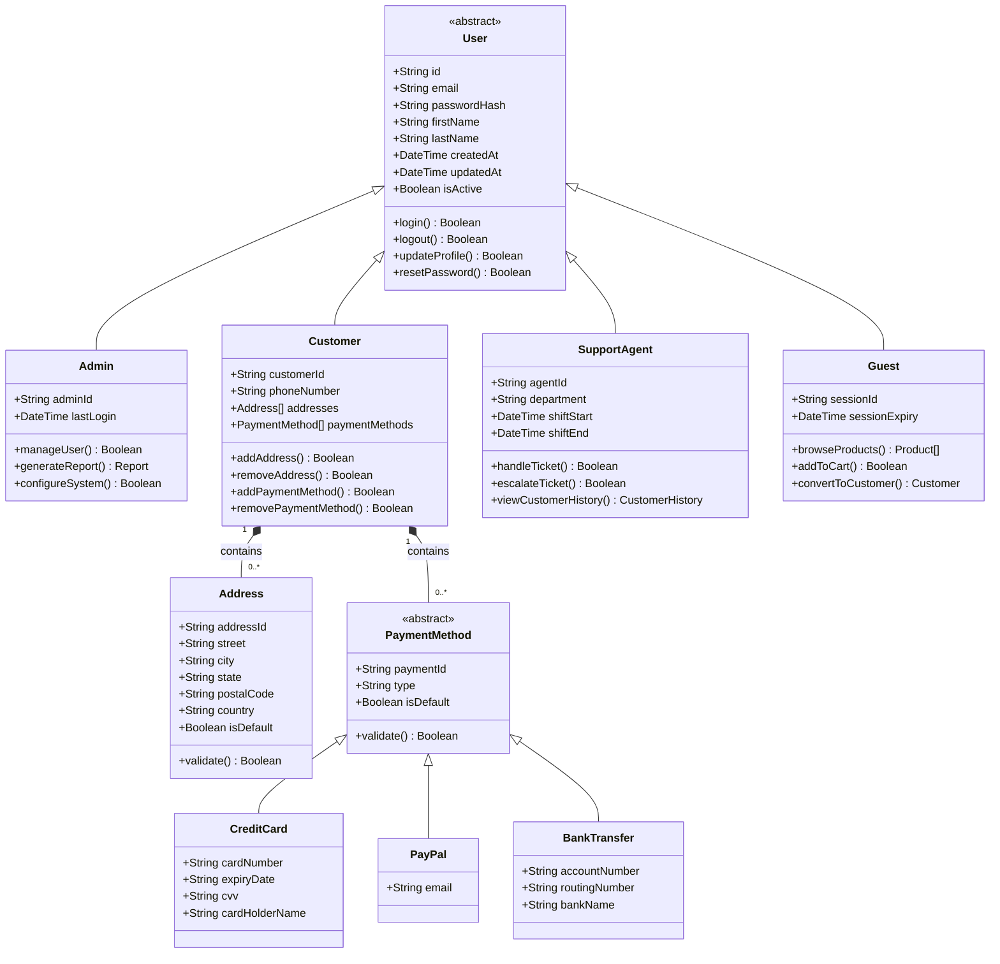
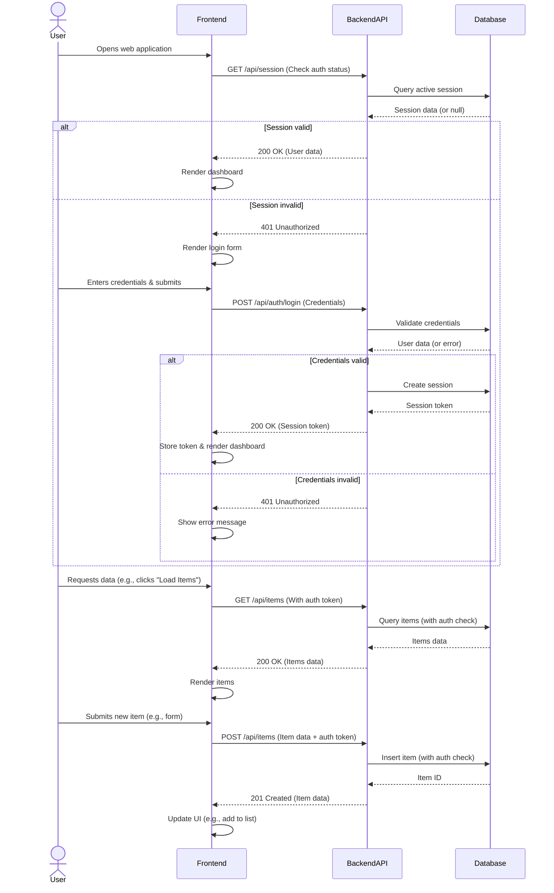

# Design Document

**Project:** Unknown
**Generated At:** 2026-03-13 20:28:28

---

## 1. Architecture Design

Since the project requirements are unknown, I'll design a **flexible, scalable, and maintainable** architecture based on the provided tech stack hints (`React`, `FastAPI`, `PostgreSQL`). This will serve as a **foundational template** that can be adapted to most modern web applications (e.g., SaaS, internal tools, or customer-facing apps).

---

# **Software Architecture Document**
**Project:** *Generic Web Application*
**Architecture Pattern:** *Modular Monolith* (with potential to evolve into microservices if needed)

---

## **1. System Overview**
The system follows a **3-tier architecture** (frontend, backend, database) with clear separation of concerns. It is designed as a **modular monolith** to balance simplicity and scalability:
- **Frontend:** Single-page application (SPA) built with React.
- **Backend:** FastAPI (Python) serving RESTful/GraphQL APIs.
- **Database:** PostgreSQL (relational) with potential for caching (Redis) and object storage (S3).
- **Deployment:** Containerized (Docker) with orchestration (Kubernetes) for scalability.

### **High-Level Architecture Diagram**
```
┌─────────────┐    ┌─────────────┐    ┌─────────────────┐    ┌─────────────┐
│   Client    │───▶│   CDN       │───▶│   Load Balancer  │───▶│  Frontend   │
└─────────────┘    └─────────────┘    └─────────────────┘    └─────────────┘
                                                                   │
                                                                   ▼
┌───────────────────────────────────────────────────────────────────────────┐
│                            Backend (FastAPI)                              │
│                                                                           │
│  ┌─────────────┐    ┌─────────────┐    ┌─────────────┐    ┌─────────────┐  │
│  │  API Layer  │───▶│  Service    │───▶│  Data       │───▶│  Database   │  │
│  │ (REST/GraphQL)│  │  Layer      │    │  Access     │    │ (PostgreSQL)│  │
│  └─────────────┘    └─────────────┘    └─────────────┘    └─────────────┘  │
│                                                                           │
│  ┌─────────────┐    ┌─────────────┐                                      │
│  │  Auth       │    │  Background │                                      │
│  │  Service    │    │  Jobs       │                                      │
│  └─────────────┘    └─────────────┘                                      │
└───────────────────────────────────────────────────────────────────────────┘
```

### **Key Design Principles**
- **Separation of Concerns:** Clear division between API, service, and data layers.
- **Scalability:** Stateless backend services can scale horizontally.
- **Extensibility:** Modular design allows adding new features without major refactoring.
- **Security:** Authentication, authorization, and input validation at all layers.
- **Observability:** Logging, monitoring, and tracing (e.g., Prometheus, Grafana, OpenTelemetry).

---

## **2. Technology Stack**
| **Layer**       | **Technology**               | **Purpose**                                                                 |
|-----------------|-----------------------------|-----------------------------------------------------------------------------|
| **Frontend**    | React (TypeScript)          | Single-page application with component-based UI.                           |
|                 | Next.js (optional)          | SSR/SSG for SEO and performance.                                           |
|                 | Redux / Zustand             | State management.                                                          |
|                 | Tailwind CSS / Material-UI  | Styling.                                                                   |
|                 | Vite / Webpack              | Build tool.                                                                |
| **Backend**     | FastAPI (Python)            | High-performance API framework with async support.                         |
|                 | Pydantic                    | Data validation and serialization.                                         |
|                 | SQLAlchemy / Tortoise-ORM   | ORM for database interactions.                                             |
|                 | Celery / FastAPI BackgroundTasks | Background job processing.                                         |
|                 | Redis                       | Caching and rate limiting.                                                 |
| **Database**    | PostgreSQL                  | Primary relational database.                                               |
|                 | TimescaleDB (optional)      | Time-series data (if needed).                                              |
|                 | S3 / MinIO                  | File storage (e.g., user uploads).                                         |
| **DevOps**      | Docker                      | Containerization.                                                          |
|                 | Kubernetes (optional)       | Orchestration for scaling.                                                 |
|                 | Terraform / Pulumi          | Infrastructure as Code (IaC).                                              |
|                 | GitHub Actions / GitLab CI  | CI/CD pipelines.                                                           |
| **Monitoring**  | Prometheus + Grafana        | Metrics and dashboards.                                                    |
|                 | ELK Stack / Loki            | Logging.                                                                   |
|                 | Sentry                      | Error tracking.                                                            |
|                 | OpenTelemetry               | Distributed tracing.                                                       |
| **Testing**     | Pytest                      | Backend unit/integration tests.                                            |
|                 | Jest + React Testing Library | Frontend unit/integration tests.                                           |
|                 | Cypress / Playwright        | E2E testing.                                                               |

---

## **3. Component Breakdown**
The system is divided into **modules**, each encapsulating a specific domain or functionality. Below are the **core modules** (can be extended as needed):

### **Frontend Components**
| **Module**          | **Description**                                                                 |
|---------------------|-------------------------------------------------------------------------------|
| **Auth Module**     | Login, registration, password reset, OAuth (Google/GitHub).                   |
| **Dashboard**       | Main UI for users to interact with the system.                                |
| **Admin Panel**     | CRUD operations for administrators (if applicable).                           |
| **Shared Components** | Reusable UI components (buttons, modals, forms, tables).                    |
| **API Client**      | Axios/React Query wrapper for backend API calls.                              |
| **State Management** | Global state (e.g., user session, theme preferences).                        |

### **Backend Services**
| **Module**               | **Description**                                                                 |
|--------------------------|-------------------------------------------------------------------------------|
| **API Layer**            | RESTful/GraphQL endpoints (FastAPI routers).                                  |
| **Auth Service**         | Handles authentication (JWT/OAuth) and authorization (RBAC).                  |
| **User Service**         | Manages user profiles, roles, and permissions.                                |
| **Core Business Logic**  | Domain-specific services (e.g., "Order Service" for e-commerce).              |
| **Data Access Layer**    | Database interactions (SQLAlchemy/Tortoise-ORM).                              |
| **Background Jobs**      | Celery/FastAPI tasks for async processing (e.g., emails, reports).            |
| **File Storage Service** | Handles file uploads/downloads (S3/MinIO).                                    |
| **Notification Service** | Sends emails, push notifications, or in-app alerts.                          |
| **Analytics Service**    | Tracks user activity and generates reports (optional).                       |

---

## **4. API Design**
The backend exposes a **RESTful API** (with optional GraphQL support). Below are the **core endpoints** (can be extended based on requirements):

### **Base URL**
`https://api.example.com/v1`

### **Authentication Endpoints**
| **Endpoint**               | **Method** | **Description**                                                                 |
|----------------------------|------------|-------------------------------------------------------------------------------|
| `/auth/register`           | POST       | Register a new user.                                                          |
| `/auth/login`              | POST       | Login with email/password (returns JWT).                                      |
| `/auth/logout`             | POST       | Logout (invalidates JWT).                                                     |
| `/auth/refresh`            | POST       | Refresh access token.                                                         |
| `/auth/forgot-password`    | POST       | Initiate password reset flow.                                                 |
| `/auth/reset-password`     | POST       | Reset password with token.                                                    |
| `/auth/oauth/{provider}`   | GET        | OAuth login (e.g., Google, GitHub).                                           |

### **User Management Endpoints**
| **Endpoint**               | **Method** | **Description**                                                                 |
|----------------------------|------------|-------------------------------------------------------------------------------|
| `/users`                   | GET        | List all users (admin only).                                                  |
| `/users/me`                | GET        | Get current user profile.                                                     |
| `/users/{id}`              | GET        | Get user by ID.                                                               |
| `/users/{id}`              | PUT        | Update user profile.                                                          |
| `/users/{id}`              | DELETE     | Delete user (admin only).                                                     |
| `/users/{id}/roles`        | POST       | Assign roles to user (admin only).                                            |

### **Example Domain-Specific Endpoints (Customizable)**
*(Replace with your actual domain, e.g., "orders" for e-commerce, "tasks" for a project management tool.)*

| **Endpoint**               | **Method** | **Description**                                                                 |
|----------------------------|------------|-------------------------------------------------------------------------------|
| `/items`                   | GET        | List all items.                                                               |
| `/items`                   | POST       | Create a new item.                                                            |
| `/items/{id}`              | GET        | Get item by ID.                                                               |
| `/items/{id}`              | PUT        | Update item.                                                                  |
| `/items/{id}`              | DELETE     | Delete item.                                                                  |
| `/items/{id}/actions`      | POST       | Perform an action on an item (e.g., "publish", "archive").                    |

### **GraphQL (Optional)**
If GraphQL is preferred, define a schema with queries/mutations:
```graphql
type Query {
  users: [User!]!
  user(id: ID!): User
  items: [Item!]!
  item(id: ID!): Item
}

type Mutation {
  createUser(input: UserInput!): User!
  updateUser(id: ID!, input: UserInput!): User!
  deleteUser(id: ID!): Boolean!
  createItem(input: ItemInput!): Item!
}
```

---

## **5. Authentication & Authorization**
### **Authentication**
- **JWT (JSON Web Tokens)** for stateless authentication.
  - Access token (short-lived, e.g., 15 minutes).
  - Refresh token (long-lived, e.g., 7 days; stored in HTTP-only cookies).
- **OAuth 2.0** for third-party logins (Google, GitHub, etc.).
- **Password hashing** with `bcrypt` or `Argon2`.

### **Authorization**
- **Role-Based Access Control (RBAC):**
  - Roles: `admin`, `user`, `guest`.
  - Permissions: Defined per role (e.g., `read:users`, `delete:items`).
- **Attribute-Based Access Control (ABAC):** Optional for fine-grained control (e.g., "only allow users to edit their own posts").
- **Middleware:** FastAPI dependency to validate JWT and check permissions.

### **Example RBAC Implementation**
```python
# FastAPI dependency
from fastapi import Depends, HTTPException, status
from fastapi.security import OAuth2PasswordBearer

oauth2_scheme = OAuth2PasswordBearer(tokenUrl="auth/login")

async def get_current_user(token: str = Depends(oauth2_scheme)):
    # Decode JWT and return user
    ...

async def get_current_active_user(current_user: User = Depends(get_current_user)):
    if not current_user.is_active:
        raise HTTPException(status_code=400, detail="Inactive user")
    return current_user

async def get_admin_user(current_user: User = Depends(get_current_active_user)):
    if "admin" not in current_user.roles:
        raise HTTPException(status_code=403, detail="Admin access required")
    return current_user
```

---

## **6. Data Flow**
### **Request Lifecycle**
1. **Client** sends HTTP request to the backend (e.g., `GET /items`).
2. **Load Balancer** routes the request to an available backend instance.
3. **API Layer (FastAPI)**:
   - Validates the request (headers, query params, body).
   - Checks authentication (JWT) and authorization (RBAC).
4. **Service Layer**:
   - Executes business logic (e.g., "fetch items from database").
   - Calls the **Data Access Layer** to interact with PostgreSQL.
5. **Data Access Layer**:
   - Constructs and executes SQL queries (via SQLAlchemy/Tortoise-ORM).
   - Returns raw data to the service layer.
6. **Service Layer**:
   - Transforms data (e.g., converts database models to Pydantic schemas).
   - Returns response to the API layer.
7. **API Layer**:
   - Serializes the response (e.g., JSON).
   - Sends the response back to the client.

### **Example: Creating an Item**
1. Client sends `POST /items` with `{ "name": "Laptop", "price": 999 }`.
2. FastAPI validates the request body using Pydantic.
3. Auth middleware checks if the user is authenticated and has `create:items` permission.
4. `ItemService.create_item()` is called:
   - Validates business rules (e.g., "price must be positive").
   - Calls `ItemRepository.save()` to insert into PostgreSQL.
5. PostgreSQL returns the created item.
6. `ItemService` returns the item to the API layer.
7. FastAPI returns `201 Created` with the item data.

### **Async Data Flow (Background Jobs)**
1. Client triggers a long-running task (e.g., "generate report").
2. FastAPI enqueues the task in **Celery** (or FastAPI BackgroundTasks).
3. Celery worker picks up the task and processes it asynchronously.
4. Worker updates the database (e.g., marks report as "completed").
5. Client polls `/reports/{id}` or receives a WebSocket notification when done.

---

## **Next Steps**
1. **Refine Requirements:** Adapt the architecture to specific functional/non-functional requirements.
2. **Database Schema:** Design PostgreSQL tables (e.g., `users`, `items`, `roles`).
3. **Infrastructure:** Set up Docker, Kubernetes, and CI/CD pipelines.
4. **Monitoring:** Configure Prometheus, Grafana, and logging.
5. **Testing:** Write unit, integration, and E2E tests.

Would you like to dive deeper into any specific area (e.g., database schema, deployment, or security)?

---

## 2. Database Schema

Since the project is "Unknown" and no specific entities or requirements are provided, I'll design a **generic, modular, and scalable database schema** for a modern web application. This schema will cover common entities like **Users, Organizations, Roles, Permissions, and Audit Logs**, which are foundational for most applications.

If you provide specific entities or requirements, I can refine this schema accordingly.

---

# **Database Schema for a Modern Web Application**

## **1. Core Entities & Tables**

### **1.1. `users`**
Stores user account information.

| Column Name      | Data Type          | Constraints                     | Description                                  |
|------------------|--------------------|---------------------------------|----------------------------------------------|
| `id`             | UUID               | PRIMARY KEY, NOT NULL           | Unique user identifier.                      |
| `email`          | VARCHAR(255)       | UNIQUE, NOT NULL                | User's email (used for login).               |
| `password_hash`  | VARCHAR(255)       | NOT NULL                        | Securely hashed password.                    |
| `first_name`     | VARCHAR(100)       | NOT NULL                        | User's first name.                           |
| `last_name`      | VARCHAR(100)       | NOT NULL                        | User's last name.                            |
| `phone`          | VARCHAR(20)        |                                 | User's phone number.                         |
| `is_active`      | BOOLEAN            | DEFAULT TRUE                    | Whether the account is active.               |
| `is_verified`    | BOOLEAN            | DEFAULT FALSE                   | Whether the email is verified.               |
| `last_login_at`  | TIMESTAMPTZ        |                                 | Timestamp of the last login.                 |
| `created_at`     | TIMESTAMPTZ        | DEFAULT NOW(), NOT NULL         | When the user was created.                   |
| `updated_at`     | TIMESTAMPTZ        | DEFAULT NOW(), NOT NULL         | When the user was last updated.              |
| `deleted_at`     | TIMESTAMPTZ        |                                 | Soft delete timestamp.                       |

**Indexing Recommendations:**
- `email` (UNIQUE)
- `created_at` (for analytics)
- `last_login_at` (for monitoring inactive users)

---

### **1.2. `organizations`**
Stores organization data (for multi-tenancy support).

| Column Name      | Data Type          | Constraints                     | Description                                  |
|------------------|--------------------|---------------------------------|----------------------------------------------|
| `id`             | UUID               | PRIMARY KEY, NOT NULL           | Unique organization identifier.              |
| `name`           | VARCHAR(255)       | NOT NULL                        | Organization name.                           |
| `slug`           | VARCHAR(100)       | UNIQUE, NOT NULL                | URL-friendly identifier (e.g., `acme-inc`).  |
| `logo_url`       | VARCHAR(512)       |                                 | URL to the organization's logo.              |
| `is_active`      | BOOLEAN            | DEFAULT TRUE                    | Whether the organization is active.          |
| `created_at`     | TIMESTAMPTZ        | DEFAULT NOW(), NOT NULL         | When the organization was created.           |
| `updated_at`     | TIMESTAMPTZ        | DEFAULT NOW(), NOT NULL         | When the organization was last updated.      |
| `deleted_at`     | TIMESTAMPTZ        |                                 | Soft delete timestamp.                       |

**Indexing Recommendations:**
- `slug` (UNIQUE)
- `created_at` (for analytics)

---

### **1.3. `organization_members`**
Maps users to organizations (many-to-many relationship).

| Column Name      | Data Type          | Constraints                     | Description                                  |
|------------------|--------------------|---------------------------------|----------------------------------------------|
| `id`             | UUID               | PRIMARY KEY, NOT NULL           | Unique membership identifier.                |
| `user_id`        | UUID               | NOT NULL, REFERENCES `users(id)`| User ID.                                     |
| `organization_id`| UUID               | NOT NULL, REFERENCES `organizations(id)` | Organization ID.                     |
| `role_id`        | UUID               | NOT NULL, REFERENCES `roles(id)`| Role assigned to the user in the org.        |
| `invited_by`     | UUID               | REFERENCES `users(id)`          | Who invited the user (optional).             |
| `invited_at`     | TIMESTAMPTZ        |                                 | When the invitation was sent.                |
| `joined_at`      | TIMESTAMPTZ        |                                 | When the user accepted the invitation.       |
| `is_active`      | BOOLEAN            | DEFAULT TRUE                    | Whether the membership is active.            |
| `created_at`     | TIMESTAMPTZ        | DEFAULT NOW(), NOT NULL         | When the membership was created.             |
| `updated_at`     | TIMESTAMPTZ        | DEFAULT NOW(), NOT NULL         | When the membership was last updated.        |

**Indexing Recommendations:**
- Composite index on `(user_id, organization_id)` (UNIQUE)
- `role_id` (for role-based queries)
- `is_active` (for filtering active members)

---

### **1.4. `roles`**
Defines roles within an organization (e.g., Admin, Member, Guest).

| Column Name      | Data Type          | Constraints                     | Description                                  |
|------------------|--------------------|---------------------------------|----------------------------------------------|
| `id`             | UUID               | PRIMARY KEY, NOT NULL           | Unique role identifier.                      |
| `name`           | VARCHAR(50)        | NOT NULL                        | Role name (e.g., "Admin", "Member").         |
| `description`    | TEXT               |                                 | Role description.                            |
| `is_default`     | BOOLEAN            | DEFAULT FALSE                   | Whether this is the default role for new members. |
| `created_at`     | TIMESTAMPTZ        | DEFAULT NOW(), NOT NULL         | When the role was created.                   |
| `updated_at`     | TIMESTAMPTZ        | DEFAULT NOW(), NOT NULL         | When the role was last updated.              |

**Indexing Recommendations:**
- `name` (UNIQUE per organization if scoped)
- `is_default` (for quick lookups)

---

### **1.5. `permissions`**
Defines fine-grained permissions (e.g., `read:users`, `write:posts`).

| Column Name      | Data Type          | Constraints                     | Description                                  |
|------------------|--------------------|---------------------------------|----------------------------------------------|
| `id`             | UUID               | PRIMARY KEY, NOT NULL           | Unique permission identifier.                |
| `name`           | VARCHAR(100)       | UNIQUE, NOT NULL                | Permission name (e.g., `read:users`).        |
| `description`    | TEXT               |                                 | Permission description.                      |
| `created_at`     | TIMESTAMPTZ        | DEFAULT NOW(), NOT NULL         | When the permission was created.             |
| `updated_at`     | TIMESTAMPTZ        | DEFAULT NOW(), NOT NULL         | When the permission was last updated.        |

**Indexing Recommendations:**
- `name` (UNIQUE)

---

### **1.6. `role_permissions`**
Maps roles to permissions (many-to-many relationship).

| Column Name      | Data Type          | Constraints                     | Description                                  |
|------------------|--------------------|---------------------------------|----------------------------------------------|
| `id`             | UUID               | PRIMARY KEY, NOT NULL           | Unique mapping identifier.                   |
| `role_id`        | UUID               | NOT NULL, REFERENCES `roles(id)`| Role ID.                                     |
| `permission_id`  | UUID               | NOT NULL, REFERENCES `permissions(id)` | Permission ID.                       |
| `created_at`     | TIMESTAMPTZ        | DEFAULT NOW(), NOT NULL         | When the mapping was created.                |

**Indexing Recommendations:**
- Composite index on `(role_id, permission_id)` (UNIQUE)

---

### **1.7. `audit_logs`**
Tracks important actions for security and compliance.

| Column Name      | Data Type          | Constraints                     | Description                                  |
|------------------|--------------------|---------------------------------|----------------------------------------------|
| `id`             | UUID               | PRIMARY KEY, NOT NULL           | Unique log entry identifier.                 |
| `user_id`        | UUID               | REFERENCES `users(id)`          | Who performed the action (nullable if system). |
| `organization_id`| UUID               | REFERENCES `organizations(id)`  | Organization context (nullable).             |
| `action`         | VARCHAR(50)        | NOT NULL                        | Action type (e.g., `user.login`, `role.update`). |
| `entity_type`    | VARCHAR(50)        |                                 | Type of entity affected (e.g., `User`, `Role`). |
| `entity_id`      | UUID               |                                 | ID of the affected entity.                   |
| `metadata`       | JSONB              |                                 | Additional context (e.g., old/new values).   |
| `ip_address`     | VARCHAR(45)        |                                 | IP address of the request.                   |
| `user_agent`     | TEXT               |                                 | User agent string.                           |
| `created_at`     | TIMESTAMPTZ        | DEFAULT NOW(), NOT NULL         | When the action occurred.                    |

**Indexing Recommendations:**
- `user_id` (for user-specific logs)
- `organization_id` (for org-specific logs)
- `action` (for filtering by action type)
- `created_at` (for time-based queries)
- `entity_type, entity_id` (for entity-specific logs)

---

## **2. Relationships**

| Relationship                     | Type               | Description                                  |
|----------------------------------|--------------------|----------------------------------------------|
| `users` → `organization_members` | One-to-Many        | A user can belong to multiple organizations. |
| `organizations` → `organization_members` | One-to-Many | An organization has many members. |
| `organization_members` → `roles` | Many-to-One        | A member has one role in an organization.    |
| `roles` → `role_permissions`     | One-to-Many        | A role has many permissions.                 |
| `permissions` → `role_permissions` | One-to-Many      | A permission can belong to many roles.       |
| `users` → `audit_logs`           | One-to-Many        | A user can generate many audit logs.         |
| `organizations` → `audit_logs`   | One-to-Many        | An organization can have many audit logs.    |

---

## **3. Additional Recommendations**

### **3.1. Multi-Tenancy Strategy**
- **Option 1: Schema-per-Tenant** (PostgreSQL)
  - Each organization gets its own schema.
  - Pros: Strong isolation, easier backups.
  - Cons: Harder to manage, schema migrations are complex.
- **Option 2: Row-Level Security (RLS)**
  - Use PostgreSQL RLS to filter data by `organization_id`.
  - Pros: Simpler to manage, single schema.
  - Cons: Requires careful query design.

### **3.2. Soft Deletes**
- All tables include a `deleted_at` column for soft deletes.
- Use triggers or application logic to exclude soft-deleted records.

### **3.3. UUIDs vs. Integers**
- **UUIDs** are used for:
  - Better security (harder to guess IDs).
  - No need for centralized ID generation.
  - Works well with distributed systems.
- **Auto-incrementing integers** can be used if:
  - Performance is critical (UUIDs are larger).
  - You need sequential IDs for analytics.

### **3.4. Indexing Best Practices**
- **Composite Indexes**: For frequently queried columns (e.g., `(user_id, organization_id)`).
- **Partial Indexes**: For filtering on `is_active = true`.
- **GIN Indexes**: For JSONB columns (e.g., `audit_logs.metadata`).

### **3.5. Partitioning**
- **Audit Logs**: Partition by `created_at` (e.g., monthly) for large-scale applications.
- **Organization Data**: Partition by `organization_id` if using a single schema.

### **3.6. Caching**
- Cache frequently accessed data (e.g., user permissions) in Redis.
- Use cache invalidation strategies (e.g., on role/permission updates).

---

## **4. Example Queries**

### **4.1. Get All Permissions for a User in an Organization**
```sql
SELECT p.*
FROM permissions p
JOIN role_permissions rp ON p.id = rp.permission_id
JOIN roles r ON rp.role_id = r.id
JOIN organization_members om ON r.id = om.role_id
WHERE om.user_id = 'user-uuid' AND om.organization_id = 'org-uuid';
```

### **4.2. Check if a User Has a Specific Permission**
```sql
SELECT EXISTS (
  SELECT 1
  FROM permissions p
  JOIN role_permissions rp ON p.id = rp.permission_id
  JOIN roles r ON rp.role_id = r.id
  JOIN organization_members om ON r.id = om.role_id
  WHERE om.user_id = 'user-uuid'
    AND om.organization_id = 'org-uuid'
    AND p.name = 'read:users'
);
```

---

## **5. Next Steps**
1. **Refine based on specific requirements** (e.g., add domain-specific tables).
2. **Implement database migrations** (e.g., using Flyway, Liquibase, or Alembic).
3. **Set up monitoring** (e.g., slow queries, connection pools).
4. **Plan for scaling** (e.g., read replicas, sharding).

Would you like me to extend this schema for a specific domain (e.g., e-commerce, SaaS, social media)?

---

## 3. Class Diagram



---

## 4. Sequence Diagram



---

_This document was auto-generated by the SDLC Optimization Framework._
