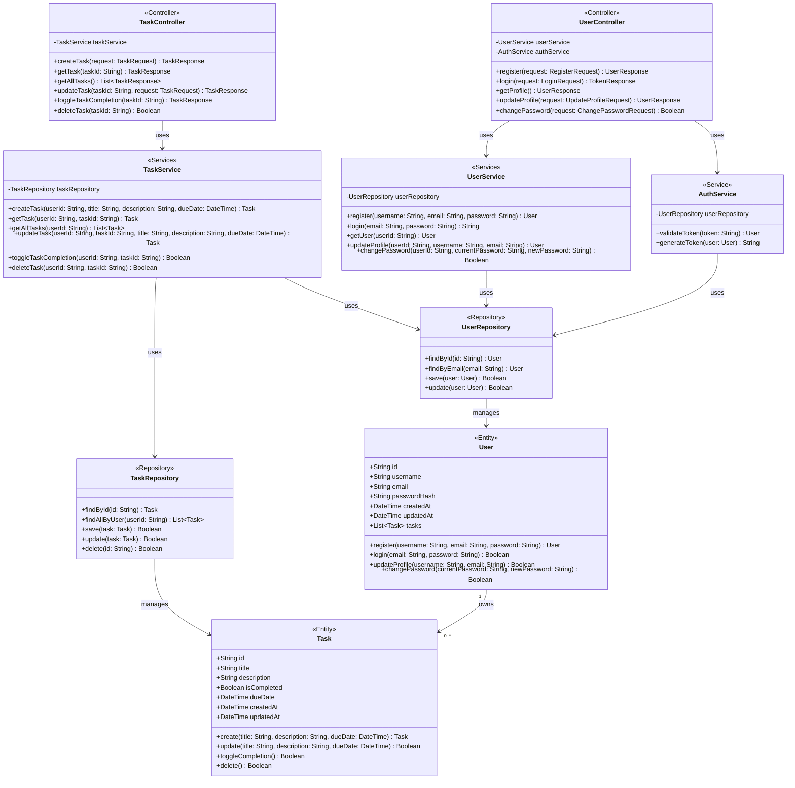
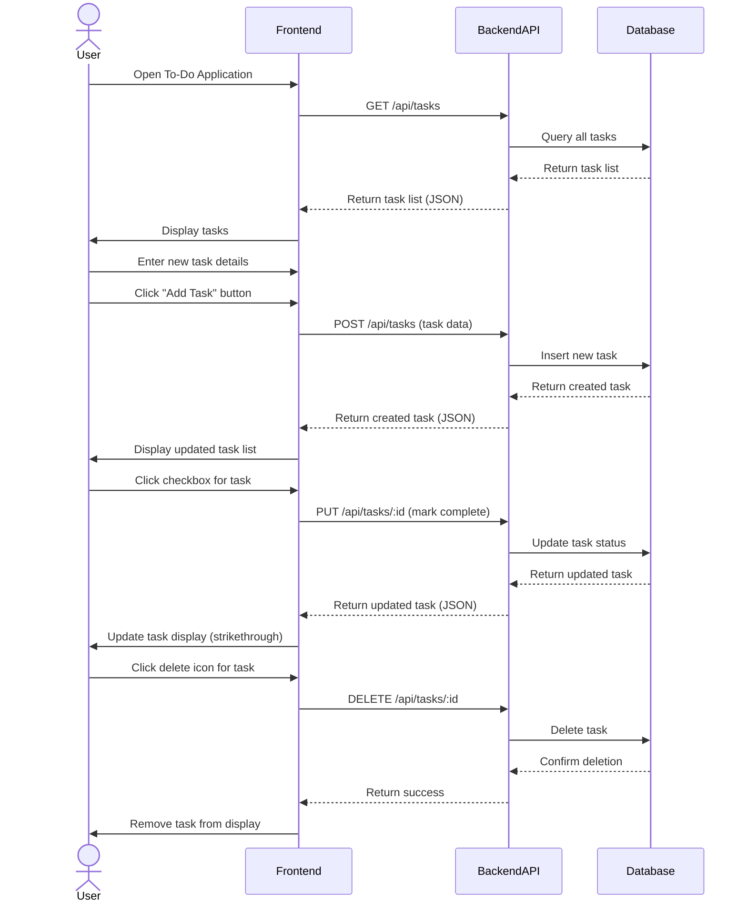

# Design Document

**Project:** To-Do Application
**Generated At:** 2026-04-03 19:47:09

---

## 1. Architecture Design

# To-Do Application Architecture

## 1. System Overview

For this simple to-do application, I recommend a **monolithic architecture** with a **client-server model**. This approach is ideal because:

- The application is small with limited scope
- Monoliths are simpler to develop, deploy, and maintain for small projects
- No need for complex inter-service communication
- Easier to ensure data consistency
- Lower operational overhead

The system will follow a **three-tier architecture**:
1. **Presentation Layer** (Frontend)
2. **Application Layer** (Backend)
3. **Data Layer** (Database)

We'll implement **clean architecture principles** within the monolith to ensure separation of concerns and maintainability.

## 2. Technology Stack

### Frontend
- **Framework**: React.js (for web) or React Native (for mobile)
  - *Rationale*: Popular, component-based, excellent ecosystem, good performance
- **State Management**: React Context API or Redux (if complexity grows)
- **Styling**: CSS Modules or Tailwind CSS
- **Build Tool**: Vite (for web) or Metro (for React Native)
- **Testing**: Jest + React Testing Library

### Backend
- **Runtime**: Node.js with TypeScript
  - *Rationale*: JavaScript/TypeScript full-stack consistency, large ecosystem, good performance
- **Framework**: Express.js or Fastify
  - *Rationale*: Lightweight, flexible, easy to set up
- **Validation**: Zod or Joi
- **Testing**: Jest + Supertest

### Database
- **Primary Database**: SQLite (for development/simple deployment) or PostgreSQL (for production)
  - *Rationale*:
    - SQLite: Zero-configuration, file-based, perfect for simple apps
    - PostgreSQL: More robust, supports scaling if needed, ACID compliant
- **ORM/Query Builder**: Prisma or TypeORM
  - *Rationale*: Type safety, good migration support, developer experience

### Infrastructure & DevOps
- **Version Control**: Git (GitHub/GitLab)
- **CI/CD**: GitHub Actions or GitLab CI
- **Containerization**: Docker (for consistent development/production environments)
- **Hosting**:
  - Frontend: Vercel, Netlify, or AWS S3 + CloudFront
  - Backend: Render, Railway, or AWS EC2
  - Database: Hosted PostgreSQL (e.g., AWS RDS, Supabase) or SQLite file
- **Monitoring**: Basic logging with Winston or Pino

### Tools
- **API Documentation**: Swagger/OpenAPI
- **Code Quality**: ESLint, Prettier
- **Type Checking**: TypeScript
- **Environment Management**: dotenv

## 3. Component Breakdown

### Frontend Components
1. **TaskList Component**
   - Displays all tasks
   - Handles task completion and deletion
   - Shows loading and empty states
2. **TaskItem Component**
   - Individual task display
   - Checkbox for completion
   - Delete button
3. **TaskForm Component**
   - Input field for new tasks
   - Submit button
4. **App Component**
   - Main component that orchestrates others
   - Handles global state if needed
5. **API Service**
   - Handles all API calls to the backend
   - Manages request/response transformations
6. **ErrorBoundary Component**
   - Catches and displays errors gracefully

### Backend Components
1. **Task Controller**
   - Handles HTTP requests related to tasks
   - Validates input
   - Calls appropriate service methods
2. **Task Service**
   - Contains business logic for task operations
   - Handles data transformations
   - Coordinates with repository
3. **Task Repository**
   - Interfaces with the database
   - Performs CRUD operations
4. **Task Model**
   - Defines the data structure for tasks
   - Includes validation rules
5. **API Routes**
   - Defines all task-related endpoints
   - Sets up middleware (auth, validation, etc.)
6. **Middleware**
   - Error handling middleware
   - Request validation middleware
   - Authentication middleware (if needed)
7. **Configuration**
   - Environment variable management
   - Database connection setup
8. **Utilities**
   - Logging
   - Response formatting

### Shared Components (if using TypeScript full-stack)
1. **Types/Interfaces**
   - Shared TypeScript types between frontend and backend
   - API request/response types

## 4. API Design

### Base URL
`/api/v1`

### Endpoints

| Endpoint          | Method | Description                          | Request Body                     | Response Body                     |
|-------------------|--------|--------------------------------------|----------------------------------|-----------------------------------|
| `/tasks`          | GET    | Get all tasks                        | -                                | `{ tasks: Task[] }`               |
| `/tasks`          | POST   | Create a new task                    | `{ title: string }`              | `{ task: Task }`                  |
| `/tasks/:id`      | GET    | Get a specific task                  | -                                | `{ task: Task }`                  |
| `/tasks/:id`      | PUT    | Update a task (mark complete, etc.)  | `{ title?: string, completed?: boolean }` | `{ task: Task }` |
| `/tasks/:id`      | DELETE | Delete a task                        | -                                | `{ success: boolean }`            |

### Task Model
```typescript
interface Task {
  id: string;          // UUID
  title: string;       // Task description
  completed: boolean;  // Completion status
  createdAt: string;   // ISO date string
  updatedAt: string;   // ISO date string
}
```

### Example Requests/Responses

**Create Task**
```http
POST /api/v1/tasks
Content-Type: application/json

{
  "title": "Buy groceries"
}
```

```http
HTTP/1.1 201 Created
Content-Type: application/json

{
  "task": {
    "id": "550e8400-e29b-41d4-a716-446655440000",
    "title": "Buy groceries",
    "completed": false,
    "createdAt": "2023-11-15T10:30:00.000Z",
    "updatedAt": "2023-11-15T10:30:00.000Z"
  }
}
```

**Get All Tasks**
```http
GET /api/v1/tasks
```

```http
HTTP/1.1 200 OK
Content-Type: application/json

{
  "tasks": [
    {
      "id": "550e8400-e29b-41d4-a716-446655440000",
      "title": "Buy groceries",
      "completed": false,
      "createdAt": "2023-11-15T10:30:00.000Z",
      "updatedAt": "2023-11-15T10:30:00.000Z"
    },
    {
      "id": "550e8400-e29b-41d4-a716-446655440001",
      "title": "Walk the dog",
      "completed": true,
      "createdAt": "2023-11-14T08:15:00.000Z",
      "updatedAt": "2023-11-14T09:00:00.000Z"
    }
  ]
}
```

## 5. Authentication & Authorization

Given the simplicity of the application and the lack of user-specific requirements in the description, **authentication is not strictly necessary** for the core functionality. However, we have several options depending on future needs:

### Option 1: No Authentication (Simplest)
- **Pros**: Easiest to implement, no user management needed
- **Cons**: All tasks are visible to anyone with access to the app
- **Implementation**: Skip authentication entirely

### Option 2: Basic Local Authentication (For Future Scaling)
If we anticipate adding user accounts later, we can design for it now:

1. **Authentication Method**: JWT (JSON Web Tokens)
2. **Flow**:
   - User registers/login with email and password
   - Server returns a JWT
   - Client stores JWT (securely) and sends it with each request
3. **Endpoints**:
   - `POST /api/v1/auth/register` - Register a new user
   - `POST /api/v1/auth/login` - Login and get JWT
   - `GET /api/v1/auth/me` - Get current user info
4. **Middleware**:
   - `authenticate` middleware to verify JWT on protected routes
5. **Database**:
   - Add `users` table with `id`, `email`, `passwordHash`, etc.
   - Add `userId` foreign key to `tasks` table

### Option 3: Anonymous Sessions (Middle Ground)
- Use browser localStorage/sessionStorage to maintain a session ID
- Associate tasks with session ID in the database
- **Pros**: No login required, but tasks persist per device/browser
- **Cons**: Tasks are lost if user clears storage or switches devices

**Recommendation**: Start with **Option 1 (No Authentication)** for the initial version. If user-specific tasks are needed later, implement **Option 2 (JWT Authentication)**.

## 6. Data Flow

### 1. Initial Load (View Tasks)
```
Frontend: User opens the app
  → App makes GET /api/v1/tasks request
  → Backend: Task Controller receives request
    → Task Service fetches tasks
      → Task Repository queries database
        → Database returns tasks
      → Task Repository returns tasks to Service
    → Task Service processes tasks (e.g., sorts, filters)
    → Task Controller formats response
  → Backend returns tasks to Frontend
→ Frontend renders TaskList with tasks
```

### 2. Add Task
```
Frontend: User enters task and clicks "Add"
  → TaskForm collects input and calls API Service
  → API Service makes POST /api/v1/tasks request with task data
  → Backend: Task Controller receives request
    → Validates input (title not empty, etc.)
    → Task Service creates new task
      → Task Repository inserts task into database
        → Database returns new task
      → Task Repository returns task to Service
    → Task Service processes task (e.g., adds timestamps)
    → Task Controller formats response
  → Backend returns new task to Frontend
→ Frontend adds new task to TaskList
```

### 3. Complete Task
```
Frontend: User clicks checkbox on TaskItem
  → TaskItem calls API Service
  → API Service makes PUT /api/v1/tasks/:id request with { completed: true }
  → Backend: Task Controller receives request
    → Validates input (id exists, etc.)
    → Task Service updates task
      → Task Repository updates task in database
        → Database returns updated task
      → Task Repository returns task to Service
    → Task Service processes task
    → Task Controller formats response
  → Backend returns updated task to Frontend
→ Frontend updates TaskItem to show completed state
```

### 4. Delete Task
```
Frontend: User clicks delete button on TaskItem
  → TaskItem calls API Service
  → API Service makes DELETE /api/v1/tasks/:id request
  → Backend: Task Controller receives request
    → Validates input (id exists, etc.)
    → Task Service deletes task
      → Task Repository deletes task from database
        → Database confirms deletion
      → Task Repository returns success status
    → Task Controller formats response
  → Backend returns success status to Frontend
→ Frontend removes TaskItem from TaskList
```

### Data Flow Diagram (Text Representation)
```
┌─────────────┐       ┌─────────────┐       ┌─────────────┐
│   Frontend  │──────>│    Backend  │──────>│  Database   │
│ (React/React│       │ (Node.js)   │       │ (SQLite/    │
│  Native)    │<──────│             │<──────│  PostgreSQL)│
└─────────────┘       └─────────────┘       └─────────────┘
       ↑                     ↑                     ↑
       │                     │                     │
       │                     │                     │
       └───────── HTTP ──────┘                     │
             (REST/JSON)                            │
                                               SQL Queries
```

### Error Handling Flow
1. **Frontend Errors**:
   - Network errors: Show user-friendly message (e.g., "Could not connect to server")
   - Validation errors: Show specific error messages (e.g., "Title is required")
   - 4xx/5xx errors: Show appropriate error messages based on response

2. **Backend Errors**:
   - Input validation errors: Return 400 Bad Request with error details
   - Not found errors: Return 404 Not Found
   - Database errors: Log error, return 500 Internal Server Error
   - Use error handling middleware to catch and format errors consistently

3. **Database Errors**:
   - Connection issues: Retry or return error to backend
   - Constraint violations: Return error to backend for proper handling

## Additional Considerations

### Performance Optimization (NFR1)
1. **Frontend**:
   - Implement virtual scrolling if task list grows large
   - Use React.memo for TaskItem components to prevent unnecessary re-renders
   - Implement optimistic UI updates for better perceived performance
   - Lazy load components if the app grows

2. **Backend**:
   - Add caching for task lists (e.g., Redis) if read-heavy
   - Implement pagination for task lists if they grow large
   - Use connection pooling for database access

3. **Database**:
   - Add indexes on frequently queried fields (e.g., `id`, `userId` if applicable)
   - Consider read replicas if scaling is needed

### Data Safety (NFR2)
1. **Database**:
   - Regular backups (automated if using hosted PostgreSQL)
   - For SQLite: Implement backup mechanism (e.g., daily file copies)
   - Use transactions for write operations to ensure atomicity

2. **Backend**:
   - Input validation to prevent injection attacks
   - Rate limiting to prevent abuse
   - Secure headers (CSP, CORS, etc.)

3. **Frontend**:
   - If using localStorage for sessions, consider security implications
   - Sanitize user input before displaying to prevent XSS

### Future Extensions
While the current scope is simple, the architecture allows for extensions:
1. **User Accounts**: Add authentication as described in Option 2
2. **Task Categories/Tags**: Extend Task model and add relevant endpoints
3. **Due Dates**: Add `dueDate` field to Task model
4. **Recurring Tasks**: Add recurrence logic to Task Service
5. **Collaboration**: Add sharing functionality between users
6. **Offline Support**: Implement service worker and local caching for PWA

## Deployment Architecture

For a simple deployment:

```
┌───────────────────────────────────────────────────────┐
│                    User Device                         │
│                                                       │
│  ┌─────────────┐        ┌───────────────────────────┐  │
│  │   Frontend  │───────>│       CDN (Optional)      │  │
│  │ (React App) │        └───────────────────────────┘  │
│  └─────────────┘                    │                  │
│                                     ▼                  │
└─────────────────────────────────────┼──────────────────┘
                                      │
                                      ▼
┌───────────────────────────────────────────────────────┐
│                    Cloud Provider                     │
│                                                       │
│  ┌───────────────────────┐        ┌─────────────────┐  │
│  │      Backend          │        │    Database     │  │
│  │ (Node.js/Express)     │<───────│ (PostgreSQL)    │  │
│  └───────────────────────┘        └─────────────────┘  │
│                                                       │
└───────────────────────────────────────────────────────┘
```

For production, consider:
- Using a managed database service (e.g., AWS RDS, Supabase)
- Deploying backend to a platform like Render, Railway, or AWS Elastic Beanstalk
- Hosting frontend on Vercel, Netlify, or AWS S3 + CloudFront
- Setting up CI/CD for automated testing and deployment

This architecture provides a solid foundation for the to-do application while remaining simple and maintainable. It can scale to accommodate additional features if needed in the future.

---

## 2. Database Schema

Here's a well-designed database schema for your To-Do application following modern best practices:

```markdown
# To-Do Application Database Schema

## Entities

### 1. User
Stores user account information (added for proper task ownership)

| Column Name | Data Type       | Constraints               | Description                          |
|-------------|-----------------|---------------------------|--------------------------------------|
| id          | UUID            | PRIMARY KEY, NOT NULL     | Unique user identifier               |
| email       | VARCHAR(255)    | UNIQUE, NOT NULL          | User's email address (login)         |
| password    | VARCHAR(255)    | NOT NULL                  | Hashed password                      |
| name        | VARCHAR(100)    |                           | User's display name                  |
| created_at  | TIMESTAMPTZ     | NOT NULL, DEFAULT NOW()   | When user account was created        |
| updated_at  | TIMESTAMPTZ     | NOT NULL, DEFAULT NOW()   | When user account was last updated   |

### 2. Task
Stores task information

| Column Name   | Data Type       | Constraints                          | Description                          |
|---------------|-----------------|--------------------------------------|--------------------------------------|
| id            | UUID            | PRIMARY KEY, NOT NULL                | Unique task identifier               |
| user_id       | UUID            | NOT NULL, FOREIGN KEY (User.id)      | Owner of the task                    |
| title         | VARCHAR(255)    | NOT NULL                             | Task title/description               |
| description   | TEXT            |                                      | Detailed task description            |
| status        | VARCHAR(20)     | NOT NULL, DEFAULT 'pending'          | Task status (pending/completed)      |
| due_date      | DATE            |                                      | Optional due date for the task       |
| priority      | VARCHAR(20)     | DEFAULT 'medium'                     | Task priority (low/medium/high)      |
| created_at    | TIMESTAMPTZ     | NOT NULL, DEFAULT NOW()              | When task was created                |
| updated_at    | TIMESTAMPTZ     | NOT NULL, DEFAULT NOW()              | When task was last updated           |
| completed_at  | TIMESTAMPTZ     |                                      | When task was completed              |

## Relationships

1. **One-to-Many**: User → Task
   - One user can have many tasks
   - Implemented via `user_id` foreign key in Task table

## Indexing Recommendations

### User Table
1. **Primary Key Index** (automatically created):
   ```sql
   CREATE UNIQUE INDEX user_pkey ON "user"(id);
   ```

2. **Email Index** (for login performance):
   ```sql
   CREATE UNIQUE INDEX user_email_idx ON "user"(email);
   ```

### Task Table
1. **Primary Key Index** (automatically created):
   ```sql
   CREATE UNIQUE INDEX task_pkey ON task(id);
   ```

2. **User ID Index** (for task listing by user):
   ```sql
   CREATE INDEX task_user_id_idx ON task(user_id);
   ```

3. **Status Index** (for filtering tasks by status):
   ```sql
   CREATE INDEX task_status_idx ON task(status);
   ```

4. **Composite Index** (for common queries filtering by user and status):
   ```sql
   CREATE INDEX task_user_status_idx ON task(user_id, status);
   ```

5. **Due Date Index** (for overdue task queries):
   ```sql
   CREATE INDEX task_due_date_idx ON task(due_date);
   ```

## Additional Recommendations

1. **Soft Deletes**: Consider adding an `is_deleted` boolean column to Task table if you want to implement soft deletes instead of hard deletes.

2. **Task Categories/Tags**: If you plan to expand functionality, consider adding a separate table for categories/tags with a many-to-many relationship to tasks.

3. **Audit Log**: For production systems, consider adding an audit log table to track changes to tasks.

4. **Database Constraints**:
   - Add CHECK constraints for status and priority columns to ensure only valid values are stored
   - Example:
     ```sql
     ALTER TABLE task ADD CONSTRAINT task_status_check CHECK (status IN ('pending', 'completed'));
     ALTER TABLE task ADD CONSTRAINT task_priority_check CHECK (priority IN ('low', 'medium', 'high'));
     ```

5. **Timestamps**: The `created_at` and `updated_at` columns use TIMESTAMPTZ to properly handle time zones.
```

### Key Design Decisions:

1. **UUIDs**: Used instead of integers for primary keys to:
   - Avoid ID exposure in URLs
   - Make horizontal scaling easier
   - Prevent ID enumeration attacks

2. **User Table**: Added even though not explicitly requested to:
   - Properly implement task ownership
   - Support future multi-user functionality
   - Enable proper authentication

3. **Status Handling**: Used a string column with constraints rather than a boolean to:
   - Allow for future status expansion (e.g., "in-progress")
   - Make the status more readable in queries

4. **Timestamps**: Included comprehensive timestamping for:
   - Audit purposes
   - Performance monitoring
   - Time-based queries

5. **Indexing Strategy**: Designed to optimize:
   - User-specific task listing (most common operation)
   - Status-based filtering
   - Due date queries

This schema provides a solid foundation that can scale as your application grows while maintaining data integrity and performance.

---

## 3. Class Diagram



---

## 4. Sequence Diagram



---

_This document was auto-generated by the SDLC Optimization Framework._
